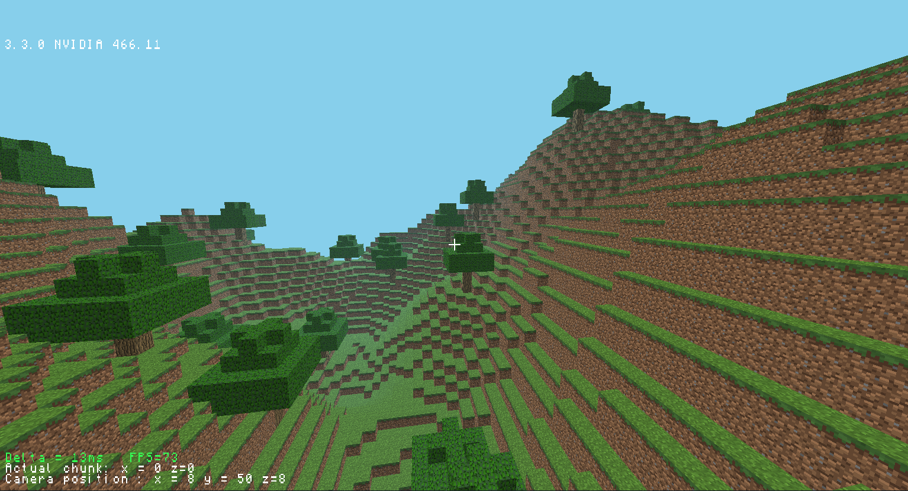
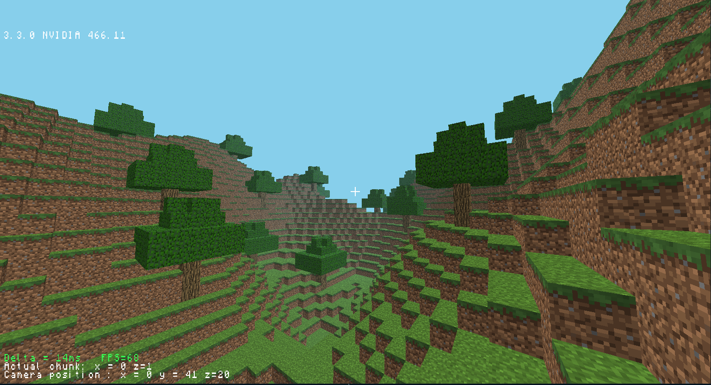
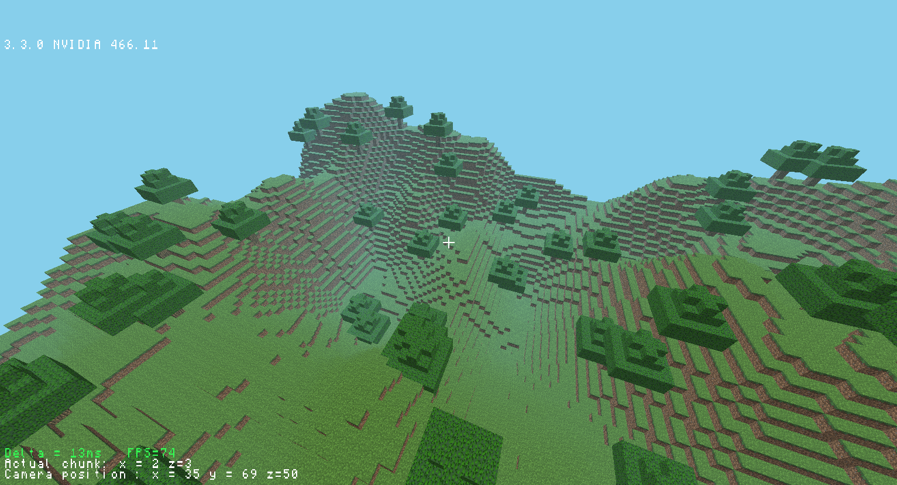

# Minecraft-Clone-OpenGL
A clone of the famous java game, coded in C++ with OpenGL. Probably my biggest, most personal project yet

## About
The game is build on a custom graphic engine, using the C++ bindings of OpenGL. Major features include:
- Optimised blocks rendering, to only render the apparent faces
- Ability to move the player's camera
- Render distance system with infinite chunks generation, while keeping GPU memory usage reasonable
- Random map generations, with mountains, grass, sand and trees, using Perlin Noise
- Simple shadow system
- Exponential fog for a more realistic look
- Text display with informations such as FPS

## Libraries used :
- `GLFW`
- `GLAD` (new versions)
- `GLEW` (for older versions of the repo)
- `glm` for maths
- `stb_image` for png loading

## Screenshots

## License
This work is licensed under the [CC-BY-NC-SA 4.0](https://creativecommons.org/licenses/by-nc-sa/4.0/) license.
